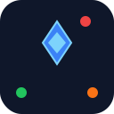

# Neon Rush



Neon Rush 是一款高性能的赛博朋克风格三消游戏，采用 Canvas 渲染技术，具备 ECS 游戏引擎架构，支持特殊组合技能和音频合成。

## 🎮 游戏特色

- **赛博朋克视觉风格**：霓虹配色和未来主义界面设计
- **流畅动画效果**：基于 Canvas 的高性能渲染
- **特殊道具系统**：
  - 直线爆炸宝石（4 连消）
  - 区域炸弹（T/L 型消除）
  - 彩虹核心（5 连直线）
- **组合技能**：多种特殊宝石组合触发强力连锁反应
- **难度选择**：简单、普通、困难三种难度模式
- **音效系统**：动态音频反馈增强游戏体验

## 🚀 技术架构

- **游戏引擎**：基于实体组件系统（ECS）架构
- **前端框架**：React 19
- **构建工具**：Vite
- **样式系统**：TailwindCSS
- **语言**：TypeScript

## 🎯 游戏玩法

1. 通过滑动交换相邻的宝石
2. 当 3 个或更多同色宝石连成直线时，它们将被消除并得分
3. 创造特殊宝石以获得更强的消除能力
4. 在限定步数内达到目标分数以通关

## ▶️ 快速开始

```bash
# 安装依赖
npm install

# 启动开发服务器
npm run dev

# 构建生产版本
npm run build
```

## 📁 项目结构

```
.
├── components/         # React 组件
├── engine/             # 游戏引擎核心
│   ├── systems/        # ECS 系统
│   └── GameEngine.ts   # 游戏引擎主类
├── services/           # 服务层
├── utils/              # 工具函数
├── public/             # 静态资源
├── App.tsx             # 主应用组件
├── index.tsx           # 应用入口
├── constants.ts        # 常量定义
├── types.ts            # 类型定义
└── vite.config.ts      # 构建配置
```

## 🎨 美术资源

游戏中使用的宝石图标均为 emoji 表情符号，包括：
- 🐻 红色宝石（熊）
- 🦊 橙色宝石（狐狸）
- 🐱 黄色宝石（猫）
- 🐸 绿色宝石（青蛙）
- 🐳 蓝色宝石（鲸鱼）
- 🐙 紫色宝石（章鱼）
- 💎 白色宝石（钻石）

## 📄 许可证

本项目仅供学习和参考使用。